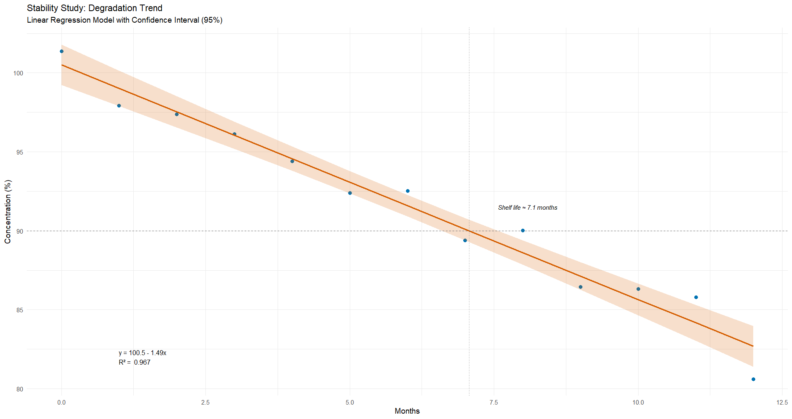

# Drug Stability — Linear Regression

> Linear regression applied to assess degradation trends in a pharmaceutical stability study over 12 months.

## 🎯 Objective

- This project aims to evaluate the degradation behavior of a drug under long-term stability conditions using linear regression models. The analysis supports decision-making regarding shelf life and product quality over time.

## 🛠️ Technologies

- **Language**: R
- **Packages**:
  - `ggplot2` – data visualization
  - `ggpmisc` – annotate regression equations and R²
  - `readr`, `dplyr` – data handling and preprocessing
 
## 📸 Example Output

